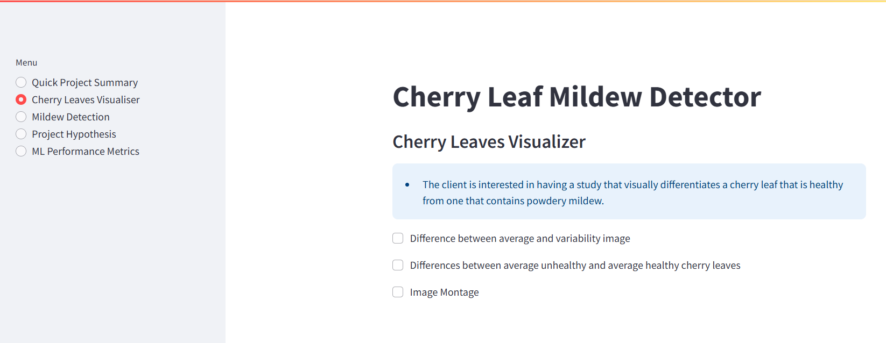
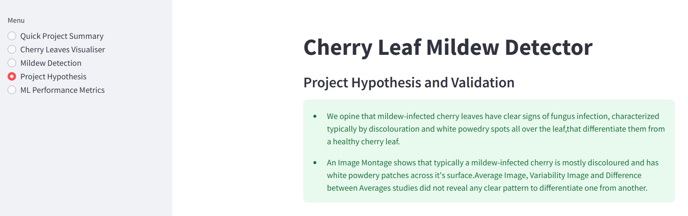

## Dataset Content

- The dataset is sourced from [Kaggle](https://www.kaggle.com/codeinstitute/cherry-leaves). We then created a fictitious user story where predictive analytics can be applied in a real project in the workplace.
- The dataset contains +4 thousand images taken from the client's crop fields. The images show healthy cherry leaves and cherry leaves that have powdery mildew, a fungal disease that affects many plant species. The cherry plantation crop is one of the finest products in their portfolio, and the company is concerned about supplying the market with a compromised quality product.

## Business Requirements

The cherry plantation crop from Farmy & Foods is facing a challenge where their cherry plantations have been presenting powdery mildew. Currently, the process is manual verification if a given cherry tree contains powdery mildew. An employee spends around 30 minutes in each tree, taking a few samples of tree leaves and verifying visually if the leaf tree is healthy or has powdery mildew. If there is powdery mildew, the employee applies a specific compound to kill the fungus. The time spent applying this compound is 1 minute. The company has thousands of cherry trees located on multiple farms across the country. As a result, this manual process is not scalable due to the time spent in the manual process inspection.

To save time in this process, the IT team suggested an ML system that detects instantly, using a leaf tree image, if it is healthy or has powdery mildew. A similar manual process is in place for other crops for detecting pests, and if this initiative is successful, there is a realistic chance to replicate this project for all other crops. The dataset is a collection of cherry leaf images provided by Farmy & Foods, taken from their crops.

- 1 - The client is interested in conducting a study to visually differentiate a healthy cherry leaf from one with powdery mildew.
  
- 2 - The client is interested in predicting if a cherry leaf is healthy or contains powdery mildew.

## Hypothesis and how to validate?

- We opine that mildew-infected cherry leaves have clear signs of fungus infection, characterized typically by discolouration and white powedry spots all over the leaf, that differentiate them from a healthy cherry leaf.
  
- An Image Montage shows that typically a mildew-infected cherry leaf is mostly discoloured and has white powdery patches across it. Average Image, Variability Image and Difference between Averages studies did not reveal any clear pattern to differentiate one from another.

## The rationale to map the business requirements to the Data Visualisations and ML tasks

Extensive consultations with the client and stakeholders culminated in 2 business requirements:

1. #### Business Requirement 
- "Conduct a study to visually differentiate a cherry leaf that is healthy from one that contains powdery mildew." 
  
  The rationale to map this business requirement to the Data Visualisations and ML tasks is predicated on the need to create a human-interpretable, and visual proof of differences between healthy and mildew-infected leaves. This would help field workers recognize symtoms manually without ML tools.

2. #### Business Requirement
- "Predicting if a cherry tree is healthy or contains powdery mildew."
  
  The rationale to map this business requirement to the Data Visualisations and ML tasks harps on the goal to automate classificaton for scalability. This would save labor cost as against manual inspection and would also help to reduce economic losses since early detection prevents crop spread.

## ML Business Case

1. #### Business Case Title:
   - **Automated Powdery Mildew Detection to Save Cherry Crop Yields*
  
2. #### Business Objective:
   - Avoid supplying the market with a product of compromised quality. 

3. #### ML Task translation of Business Case:
   - A binary classification model to distinguish healthy leaves from infected ones, paired with visual explainability tools.

4. #### Data Availability:
   - Existing dataset of 4,208 labeled cherry leaf images (healthy vs. infected).
  
5. #### Technical and Non-Technical Success Metrics:
   - Develop a model to classify leaves with 97%+ accuracy.
   - Prototype the model on a Streamlit dashboard.

6. #### Risks and Constraints:
   - Risk: Model bias due to limited data. Mitigation: Augment dataset with synthetic samples.
   - Constraint: Data provided under an NDA (non-disclosure agreement): Mitigation: Data anonymization.

7. #### ML Suitability:
   - Conventional data analysis can be used to conduct a study to visually differentiate a cherry leaf that is healthy from one that contains powdery mildew.

8. #### Methodology
This project follows the CRISP-DM methodology:
   - Business Understanding
   - Data Understanding
   - Data Preparation
   - Modelling
   - Evaluation
   - Deployment

## Dashboard Design

The dashboard consists of 5 pages including:

1. ### Quick Project Summary Page   

- This page creates a general information about the project, the project's dataset and business requirements under consideration.
- The st.sidebar.radio() widget was used to create radio buttons to display the dashboards menu on the left side of the page.
- The following streamlit commands were also used on the page
  - st.write()
  - st.info()
  - st.success()
  
2. #### Cherry Leaves Visualizer Page

- This page prototypes our models visual differentiation of a cherry leaf that is healthy from one that contains powdery mildew. Three visualizations are created on this page:
  - Visualization of the difference between an average and variability cherry leaf image
  - Visualization of the differences between average unhealthy and healthy cherry leaves
  - An image montage that selects and visualizes healthy and mildew-infested images
- The page utilizes checkboxes created using st.selectbox() widget for each visualization section.
- The st.sidebar.radio() widget was used to create radio buttons to display the dashboards menu on the left side of the page.
- The following streamlit commands were also used on the page
  - st.write()
  - st.info()
  - st.warning()
  - st.image()

3. #### Mildew Detection Page

- On this page, the client can upload a random image and test same for mildew infection. A quick check is conducted on the uploaded image and a prediction is made with 97%+ accuracy on whether the cherry leaf is healthy of not.
- The st.sidebar.radio() widget was used to create radio buttons to display the dashboards menu on the left side of the page.
- The following streamlit commands were also used on the page
  - st.write()
  - st.info()
  - st.success()
  - st.table()
  - st.markdown()

4. #### Project Hypothesis

- This page opines the project's hypothesis and validation.
- The st.sidebar.radio() widget was used to create radio buttons to display the dashboards menu on the left side of the page.
- The following streamlit commands were also used on the page
  - st.write()
  - st.success()

5. #### ML Performance Metrics

- Information about the frequency distribution of labels on the train, validation and test set is featured here.
- Information also about our model's performance during training is also disclosed here.
- The st.sidebar.radio() widget was used to create radio buttons to display the dashboards menu on the left side of the page.
- The following streamlit commands were also used on the page
  - st.write()
  - st.dataframe()
  - st.image()

## Unfixed Bugs

- There are no unfixed bugs
- A number of technologies were used to develop this project and they include:
  - Core Technologies
    - Python
    - Streamlit
  - Data Handling and Processing
    - Pandas
    - Numpy
  - Visualization Libraries
    - Matplotlib
    - Seaborn
    - Plotly
  - Machine Learning
    - TensorFlow
  - Others
    - GitHub
    - Render

## Deployment

### Render

- The App live link is: `https://milestone-project-mildew-detection-in-od3y.onrender.com/`
- The project was deployed to Render using the following steps.

1. Create and log in to Render.
2. Confirm project has requirements.txt file listing all dependencies.
3. Give Render access to your GitHub repositories.
4. Type in the start command: $ sh setup.sh && streamlit run app.py
5. Type in the build command: $ pip install -r requirements.txt
6. Select 'Free' for Instance Type.
7. Click 'Create Web Service' to deploy.
8. The deployment process should happen smoothly if all deployment files are fully functional. 
9. Click the live link on the top of the page to access your App.

## Main Data Analysis and Machine Learning Libraries

- Main Data Analysis Libraries
    - Pandas: Was used in the modelling and evaluation notebook whilst training the dataset, to create a structured tabular representation (DataFrame) of image data distribution
    - Numpy: Was used in the data visualization notebook to handle and append image arrays, reshape image arrays amongs others.
- Main Machine Learning Libraries
    - Scikit-learn: Used as a general-purpose machine learning library for our binary classification task.
    - TensorFlow: Used to conduct deep learning for image classification neural networks.

## Credits

- The bulk of the notebooks, code, processes and techniques employed to actualize the project was lifted from Code Institute's Malaria Detection Walkthrough project.
- The text and information about powdery mildew was taken from https://en.wikipedia.org/wiki/Powdery_mildew and https://phys.org/news/2018-01-combination-resistance-genes-wheat-powdery.html
